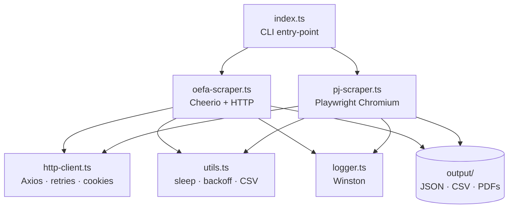

# Jurisprudencia Scraper

[](https://github.com/Jorgeotero1998/Scraper/actions/workflows/ci.yml)
[](https://nodejs.org/)
[](https://www.typescriptlang.org/)
[](https://playwright.dev/)
[](https://cheerio.js.org/)
[](https://www.docker.com/)
[](https://vitest.dev/)
[](LICENSE)

**Production-grade CLI scraper** for Peruvian legal databases — TypeScript, Playwright, Cheerio, Docker, **23 Vitest tests**, GitHub Actions CI.

> 🖥️ **CLI tool — no live demo.** Clone & run locally ([Quickstart](#quickstart)); terminal output and export layout below.

| | |
|---|---|
| **Repo** | [github.com/Jorgeotero1998/Scraper](https://github.com/Jorgeotero1998/Scraper) |
| **Interface** | CLI only — `npm run start:oefa` / `start:pj` |
| **Tests** | 23 Vitest · CI on every push (Node 18 & 20) |
| **Deploy** | Docker + docker-compose |

## CLI in action

<p align="center">
  
</p>

<p align="center"><sub><i>OEFA run — paginated scrape, exponential back-off on 429, JSON/CSV export, summary counts</i></sub></p>

A production-ready scraper for two Peruvian legal databases:

| Target | URL | Access |
|--------|-----|--------|
| **OEFA** (environmental enforcement) | `publico.oefa.gob.pe` | Public internet |
| **PJ** (Poder Judicial courts) | `jurisprudencia.pj.gob.pe` | VPN required |

Both scrapers navigate JavaServer Faces (JSF/PrimeFaces) portals, extract document
metadata, and download linked PDFs. Results are persisted as **JSON** and **CSV**.

---

## Architecture



### Module layout

```
src/
├── index.ts          CLI entry-point (--site, --output-dir, --delay, …)
├── http-client.ts    Axios wrapper — exponential back-off, cookie jar, retries
├── oefa-scraper.ts   Pure-HTTP scraper using Cheerio for DOM parsing
├── pj-scraper.ts     Playwright scraper (headless Chromium, VPN-only portal)
├── logger.ts         Winston logger — LOG_LEVEL / LOG_FORMAT env vars
├── utils.ts          Pure utilities: sleep, backoff, filename sanitisation, CSV
└── types/index.ts    Shared TypeScript interfaces
tests/
├── utils.test.ts          Unit tests for all utility functions
├── http-client.test.ts    Mocked-HTTP tests for retry / back-off logic
└── oefa-scraper.test.ts   Integration-ish scraper tests (no real network calls)
```

### Key design decisions

- **No secrets in source** — configuration via environment variables (see `.env.example`).
- **Exponential back-off with jitter** — handles HTTP 429 and 500 without hammering the server.
- **Mandatory inter-request delay** — `--delay` (default 2 000 ms) between every page request.
- **Idempotent PDF downloads** — already-downloaded files are skipped on re-runs.
- **Dual transport strategy** — Cheerio/HTTP for public OEFA; Playwright for JSF-heavy PJ portal behind VPN.

---

## Output format

```
output/
├── documents.json          Array of Document objects
├── documents.csv           Same data, RFC-4180 CSV
├── failed_downloads.json   Entries where the PDF download failed (if any)
└── pdfs/
    └── RES-2024-001.pdf    One file per resolution
```

### `Document` schema

```jsonc
{
  "rowNumber":          "1",
  "expediente":         "EXP-2024-001",
  "administrado":       "Empresa SA",
  "unidadFiscalizable": "Planta Norte",
  "sector":             "MINERÍA",
  "nroResolucion":      "RES-2024-001",
  "pdfUrl":             "listarDetalleInfraccionRAAForm:dt:0:j_id_..."
}
```

---

## Requirements

| Prerequisite | Minimum version |
|---|---|
| Node.js | 18 |
| npm | 9 |
| VPN access | Required for `--site=pj` only |

---

## Quickstart

```bash
git clone https://github.com/Jorgeotero1998/Scraper.git
cd Scraper
npm install

# Copy and optionally edit the environment file
cp .env.example .env

# Scrape OEFA (no VPN needed)
npm run start:oefa

# Scrape Poder Judicial (VPN required)
npm run start:pj
```

### CLI options

```
node dist/index.js [options]

--site=<oefa|pj>          Target portal           (default: pj)
--output-dir=<path>       Output directory         (default: output/)
--delay=<ms>              Delay between requests   (default: 2000)
--max-retries=<n>         Retry attempts on error  (default: 5)
--initial-backoff=<ms>    Base backoff duration    (default: 1000)
```

### Environment variables

| Variable | Default | Description |
|---|---|---|
| `LOG_LEVEL` | `info` | Winston log level (`error` → `silly`) |
| `LOG_FORMAT` | `text` | `text` for dev, `json` for log aggregators |
| `LOG_DIR` | `logs` | Directory for log files |

---

## Docker

```bash
# Build the image
docker build -t jurisprudencia-scraper .

# Run OEFA scraper, mounting output locally
docker run --rm -v "$(pwd)/output:/app/output" jurisprudencia-scraper --site=oefa

# Or use Compose
docker compose up scraper-oefa

# PJ (VPN profile, requires network access inside the container)
docker compose --profile pj up scraper-pj
```

---

## Development

```bash
npm run typecheck     # tsc --noEmit
npm run lint          # ESLint
npm run format        # Prettier
npm test              # Vitest
npm run test:coverage # Vitest + V8 coverage report
npm run ci            # typecheck + lint + test (what GitHub Actions runs)
```

---

## Ethics & rate-limiting

- **All scraped data is public** — both portals are government open-access resources.
- **Default delay is 2 000 ms** between every page request. Do not lower this value without
  explicit permission from the portal administrators.
- **Back-off on 429** — the client honours `Retry-After` semantics automatically.
- **PDF downloads are sequential** with a 1 500 ms delay between each.
- This tool is intended for research and portfolio purposes only.

---

## License

[MIT](LICENSE) © 2024 Jorge Otero
